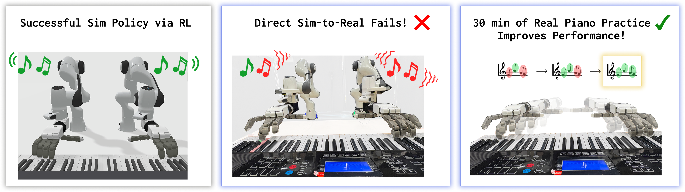

# HandelBot: Real-World Piano Playing via Fast Adaptation of Dexterous Robot Policies
Official implementation of [HandelBot](https://arxiv.org/abs/2603.12243).

\[[Paper](https://arxiv.org/abs/2603.12243)\] \[[Website](https://amberxie88.github.io/handelbot/)\] 



## Installation

You can create the conda environment directly from the `env.yml` file:

```bash
conda env create -f env.yml
conda activate handel
```

## Training in Simulation
We train with a custom ManiSkill piano environment. To train a policy:

```
python -m rl.piano_ppo_fast --horizon HORIZON --note_trajectory music_data/SONG_NAME.pkl --exp_name YOUR_EXP_NAME
```

To reproduce our results, we used the following horizon lengths:
- Twinkle Twinkle: 160
- Ode to Joy: 330
- Hot Cross Buns: 160
- Prelude in C: 330
- Fur Elise: 320

## Real-World Training
Refer to [real/src/dg5f_driver/README.md](real/src/dg5f_driver/README.md) for instructions on running on the real robot.

## Citation
```
@misc{xie2026handelbotrealworldpianoplaying,
      title={HandelBot: Real-World Piano Playing via Fast Adaptation of Dexterous Robot Policies}, 
      author={Amber Xie and Haozhi Qi and Dorsa Sadigh},
      year={2026},
      eprint={2603.12243},
      archivePrefix={arXiv},
      primaryClass={cs.RO},
      url={https://arxiv.org/abs/2603.12243}, 
}
```